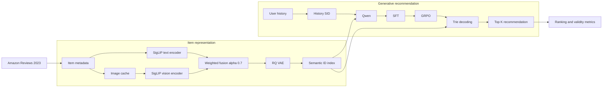

<div align="center">

# MM-OneRec

### 多模态 Semantic ID 驱动的生成式推荐系统

<p>
  <a href="#项目定位">项目定位</a> ·
  <a href="#系统架构">系统架构</a> ·
  <a href="#实验结果与数据来源">实验结果</a> ·
  <a href="#快速开始">快速开始</a> ·
  <a href="#技术摘要">技术摘要</a>
</p>


</div>

> **一句话介绍：** MM-OneRec 把 Amazon 商品的文本与图片压缩成可生成的层次化 Semantic ID，再用 Qwen 完成“用户历史 SID → 下一商品 SID”的 SFT、GRPO 与 Trie 约束解码。它保留 MiniOneRec 的生成式推荐主线，只在 Item 表征层增加一个冻结视觉分支，追求的是可运行、可解释、可复现的完整闭环。


## 项目定位

### 为什么要改造

普通的商品 ID 只是一个任意编号：它可以作为分类标签，却不是一个适合语言模型生成的结构化目标。生成式推荐还会额外遇到两个工程问题：

1. **目标空间没有语义。** `item_42857` 与 `item_42858` 的编号相邻，并不代表商品相似；
2. **自由生成不保证存在。** LLM 可能产生一个语法上完整、但目录中不存在的 item code。

MM-OneRec 的做法是把连续 Item embedding 经过残差量化，得到有限、分层、可约束的 Semantic ID；再把推荐转成短序列生成任务。文本提供标题/描述语义，图片提供外观、包装和款式信息，但多模态变化被严格限制在 `Item → Semantic ID` 这一层，不改 Qwen 的输入格式。

### 项目边界

| 维度 | MM-OneRec 的实际选择 |
| --- | --- |
| 多模态模型 | 冻结 SigLIP text/vision tower，采用轻量可复现的双塔编码 |
| 融合方式 | L2 normalize 后的加权和，默认 `alpha = 0.7`；缺图回退 text |
| Semantic ID | 复用仓库已有 RQ-VAE；额外保存 raw collision 与去重后的统计 |
| 生成模型 | Qwen2.5-0.5B/1.5B，输入仍是历史 SID 序列 |
| RL 阶段 | TRL `GRPOTrainer`，首版使用 ranking-aware reward + KL regularization |
| 合法性 | Trie prefix constrained decoding，屏蔽无效 SID continuation |
| 评估 | HR/NDCG、Coverage、Invalid SID Rate、Head/Mid/Tail 分桶 |
| 实验策略 | 先 smoke，再 small subset，最后跑单个 Amazon23 类别的正式任务 |

### 和原始 MiniOneRec 主线的关系

本项目是在 MiniOneRec 代码基础上的多模态生成式推荐工程改造：

- **保留：** RQ-VAE / RQ-KMeans、SFT 数据格式、GRPO 训练入口、Trie 解码、SASRec 工具和原许可证；
- **新增：** 图片下载与缓存、冻结视觉编码、text/image fusion、item 对齐校验、SID collision 统计、long-tail 指标、smoke mode 和实验文档；


---

## 系统架构



整个项目可以拆成两个边界清晰的子系统：

| 子系统 | 输入 | 输出 | 关键可追踪文件 |
| --- | --- | --- | --- |
| Item representation | title、description、image URL | text/image/MM embedding | `data/embeddings/`、`data/cache/` |
| Semantic ID | `[num_items, dim]` embedding | item → SID index | `data/sid/*index.json` |
| Generative training | history SID、target SID | SFT/GRPO checkpoint | `outputs/*/final_checkpoint/` |
| Constrained inference | checkpoint、SID catalog、test split | top-K SID predictions | `outputs/eval_*/` |
| Metric analysis | predictions、catalog、train frequency | metrics JSON / summary CSV | `results/summary.csv` |

---

## 多模态 Item 表征

### 1. Text branch

沿用原有 text pipeline：

```text
title + description
        ↓
frozen SigLIP text tower
        ↓
e_text ∈ R^768
```

### 2. Image branch

Amazon23 metadata 中保留了商品图片 URL。`multimodal/image_downloader.py` 对每个 item：

- 读取第一张可用图片；
- 下载到本地 cache，并写入 item-aligned JSONL manifest；
- 对 URL 缺失、HTTP 失败、坏图和重复下载分别记录状态；
- 图片无法使用时返回 `image_mask = false`，不把零向量当成真实视觉特征。

```text
image URL
    ↓  cache / retry / validate
local image file
    ↓
frozen SigLIP vision tower
    ↓
e_image ∈ R^768
```

### 3. Fusion

默认的 multimodal embedding 为：

$$
\hat{e} = \frac{e}{\lVert e\rVert_2}, \qquad
 e_{\mathrm{mm}} = \mathrm{norm}\left(\alpha\hat{e}_{\mathrm{text}} + (1-\alpha)\hat{e}_{\mathrm{image}}\right),
 \quad \alpha=0.7
$$

代码同时支持三个可复现实验开关：

| `--fusion` | 含义 |
| --- | --- |
| `text` | `e = e_text`，文本基线 |
| `image` | `e = e_image`，视觉侧诊断 |
| `weighted` | 默认 0.7 text + 0.3 image |

若两种 embedding 维度不同，`multimodal_encoder.py` 可先用确定性 PCA 投影到共同维度；本次正式 SigLIP run 的两侧都是 768 维，因此没有额外投影。

### 4. 当前正式数据的表征统计

正式任务使用 Amazon Reviews 2023 的 `Industrial_and_Scientific`，读取前 1,000,000 条 review 后进行迭代 5-core 过滤：

| 统计项 | 数值 |
| --- | ---: |
| 用户数 | 11,668 |
| 商品数 | 7,493 |
| 交互数 | 91,403 |
| image 下载成功 | 7,136 |
| image URL 缺失 | 357 |
| image 下载失败 | 0 |
| text embedding | `[7493, 768]` |
| image embedding | `[7493, 768]` |
| weighted MM embedding | `[7493, 768]` |

所有 embedding 都按 item integer id 对齐；生成 SID CSV 前会再次检查 `missing_item_count`，当前正式 Text/MM 两套 split 均为 0。

---

## Semantic ID：从连续表征到可生成目标

### RQ-VAE

对每个 item embedding，RQ-VAE 先压缩到 latent，再逐层量化残差：

```text
e_item
  └─ encoder → z
       ├─ codebook a：量化 z，得到 c1
       ├─ codebook b：量化 z - c1，得到 c2
       ├─ codebook c：继续量化残差，得到 c3
       └─ decoder：重构 embedding

SID = [<a_i>, <b_j>, <c_k>]
```

正式 run 的配置保持 Text/MM 一致：`codebooks = 32/32/32`、`latent_dim = 64`、`epochs = 100`。导出的 index 例子如下：

~~~json
{"0": ["<a_3>", "<b_31>", "<c_17>", "<d_1>"]}
~~~

### Collision 统计

多个 item 得到同一个 raw code 序列时，生成结果无法唯一映射回商品。本项目不隐藏这个问题，而是同时记录 raw collision，并在导出阶段为冲突项追加确定性的 `<d_n>` suffix，保证 catalog 中每个 item 仍可寻址。这个 suffix 是工程去重，不代表量化模型真的学到了新的语义层。

当前正式 RQ-VAE 结果：

| SID 表征 | items | raw unique SID | raw collision | raw collision rate | 去重后 unique SID |
| --- | ---: | ---: | ---: | ---: | ---: |
| Text-SID | 7,493 | 4,309 | 3,184 | 42.49% | 7,493 |
| MM-SID | 7,493 | 4,380 | 3,113 | 41.55% | 7,493 |

这里的 MM collision rate 略低只是表征诊断，不能直接等价为推荐质量提升；最终仍要看 held-out recommendation metrics。

---

## SFT → GRPO：生成式推荐训练

### SFT

核心监督任务保持简单：

```text
输入：用户历史 [SID(item_1), SID(item_2), ..., SID(item_t-1)]
目标：下一商品 SID(item_t)
```

训练目标是 causal language-model cross entropy。`minionerec/data.py` 还保留了 SID↔title 和 sequence-fusion 辅助样本，用来帮助模型理解 SID 与 item metadata 的对应关系；多模态 embedding 不会直接拼进 Qwen prompt。

### GRPO

GRPO 以同一个 user state 生成一组 candidates：

$$
A_i = \frac{r_i - \mu_r}{\sigma_r + \epsilon}
$$

当前实现使用 TRL `GRPOTrainer`，首版优先使用 ranking-aware reward，并记录 reward、reward std、policy loss、KL、advantage mean/std 等训练诊断。这里必须区分：

- SFT 学的是“用户历史下一个 SID 的似然”；
- GRPO 优化的是候选集合的相对 reward；
- 本项目当前实现是 **GRPO，不是 PPO**，没有额外训练 PPO critic。

### 训练配置原则

为了让 Text-SID 与 MM-SID 的对比可信，训练时固定：

- base model、seed、cutoff length；
- batch size、学习率、epoch 和 `num_generations`；
- reward type、KL beta、warmup 和 scheduler；
- 只改变 Item embedding → SID 这条链路。

---

## Trie Constrained Decoding

### 为什么不能自由生成

如果直接让 Qwen 自由生成：

```text
[A12][B99][C6]
```

这个序列可能并不存在于 item catalog。它看起来像 SID，但无法映射回商品，最后只能被丢弃或错误回填。

### 本项目的做法

所有合法 SID 构成一棵 prefix trie。生成每个 token 时，`minionerec/logit_processor.py` 只允许当前 prefix 的合法 child：

```text
root
├── <a_3>
│   ├── <b_31>
│   │   ├── <c_17> → <d_1> → EOS
│   │   └── <c_02> → <d_1> → EOS
│   └── <b_05> → ...
└── <a_0> → ...
```

因此约束解码解决的是“生成合法性”，不是“模型一定命中目标”。评估时仍然显式报告 `invalid_sid_rate`；约束正常工作时该值应接近 0，而不是在 README 中默认写成 0。

---

## 评估协议

### 排名指标

| 指标 | 含义 |
| --- | --- |
| `HR@5/10/20` | 真实下一 item 是否出现在前 K 个推荐中 |
| `NDCG@5/10/20` | 命中位置越靠前，折扣后的收益越高 |
| `Coverage` | 测试推荐覆盖的 catalog 比例 |
| `Invalid SID Rate` | 预测 SID 中不在合法 catalog 的比例 |

### Long-tail 分桶

按训练集 item interaction frequency 排序：

- **Head：** top 20%；
- **Mid：** 中间 60%；
- **Tail：** bottom 20%。

分别报告 `HR@10` 和 `NDCG@10`，用于观察视觉信息是否帮助低频商品。项目不会预设 MM-SID 一定改善 tail，而是把它作为可验证的分析维度。

### 评估协议

正式结果统一使用 Amazon23 `Industrial_and_Scientific_1m` 的完整 test split（7,974 条样本）、Trie constrained decoding、`num_beams=20`、`max_new_tokens=8` 和相同的指标脚本。四个 checkpoint 的输入字段、候选数和指标口径完全一致，因此 `HR@5`、`HR@10`、`HR@20` 分别对应独立的 Top-5/10/20 结果。

---

## 实验结果与数据来源

### 实验矩阵

| Track | Item representation | Dataset | Result / reference artifact |
| --- | --- | --- | --- |
| Original MiniOneRec reference | 原项目 qwen-td embedding + 原始 SID index | Amazon18 `Industrial_and_Scientific` / `Office_Products` | `data/Amazon/` |
| MM-OneRec Text-SID | frozen SigLIP text embedding + RQ-VAE | Amazon23 `Industrial_and_Scientific_1m` | `outputs/formal_amazon23_1m/text_*` |
| MM-OneRec MM-SID | normalized text/image fusion + RQ-VAE | Amazon23 `Industrial_and_Scientific_1m` | `outputs/formal_amazon23_1m/mm_*` |

### 原项目 reference data

仓库保留了原 MiniOneRec 使用的 Amazon18 数据、item metadata、SID index 和 train/valid/test CSV。它们作为独立的 reference data source，用来对照原始数据协议、SID 格式和推荐任务划分；不会与 MM-OneRec 的 Amazon23 结果混写。

| Category | Items / SID | Sequence rows | Users across splits | Tracked files |
| --- | ---: | ---: | ---: | --- |
| `Industrial_and_Scientific` | 3,686 | 40,843 | 7,524 | `data/Amazon/{index,train,valid,test}/` |
| `Office_Products` | 3,459 | 41,852 | 7,882 | `data/Amazon/{index,train,valid,test}/` |

其中 `Industrial_and_Scientific` 的 train/valid/test 行数为 `31,778 / 4,532 / 4,533`，`Office_Products` 为 `32,120 / 4,866 / 4,866`。这些文件可以直接作为原项目 baseline 的输入协议，后续替换为对应 checkpoint 的预测结果即可形成同口径对照。

### MM-OneRec 正式 Amazon23 评估

Text-SID 与 MM-SID 使用相同的 Qwen checkpoint 结构、训练任务、完整 test split 和评估脚本，仅改变 Item embedding → SID 链路。四个结果均为 7,974 条测试样本、20-beam Trie constrained decoding。

| 模型 | HR@5 | HR@10 | HR@20 | NDCG@5 | NDCG@10 | NDCG@20 | Coverage | Tail HR@10 | Invalid SID Rate |
| --- | ---: | ---: | ---: | ---: | ---: | ---: | ---: | ---: | ---: |
| Text-SID + SFT | 0.000878 | 0.001129 | 0.003261 | 0.000566 | 0.000641 | 0.001181 | 0.006806 | 0.000627 | 0.0 |
| Text-SID + GRPO | 0.000627 | 0.001379 | 0.003762 | 0.000325 | 0.000554 | 0.001171 | 0.004671 | 0.001046 | 0.0 |
| MM-SID + SFT | 0.000251 | 0.001630 | 0.007775 | 0.000103 | 0.000530 | 0.002067 | 0.006940 | 0.000418 | 0.0 |
| MM-SID + GRPO | 0.000376 | 0.002508 | 0.007650 | 0.000160 | 0.000830 | 0.002129 | 0.004137 | 0.000418 | 0.0 |

逐桶的 `HR@10`、`NDCG@10`、样本数以及完整浮点数保存在 [`results/summary.csv`](results/summary.csv)。原始预测和指标文件位于 `outputs/formal_amazon23_1m/*_predictions_k20.json` 与 `outputs/formal_amazon23_1m/*_metrics_k20.json`。

### 正式 Amazon23 表征统计

正式 `Industrial_and_Scientific_1m` 的 item-side 资产已经按同一 item order 生成：

| 统计项 | Text-SID | MM-SID |
| --- | ---: | ---: |
| Items | 7,493 | 7,493 |
| Train / valid / test rows | 63,788 / 7,973 / 7,974 | 63,788 / 7,973 / 7,974 |
| Raw unique SID | 4,309 | 4,380 |
| Raw collision rate | 42.49% | 41.55% |
| Post-dedup unique SID | 7,493 | 7,493 |
| Invalid item alignment | 0 | 0 |

这张表只描述 item representation 和数据对齐，不把 collision rate 直接解释成推荐指标；推荐质量仍由同一 evaluator 输出的 HR/NDCG、coverage 和 long-tail metrics 决定。

---

## 快速开始

### 0. 安装与验证环境

仓库提供了固定依赖清单：

~~~bash
git clone https://github.com/SuleynanAuir/OMNI-Multimodal-Intelligent-OneRec-Based-System.git MM-OneRec
cd MM-OneRec
python -m venv .venv
source .venv/bin/activate
pip install -r requirements.txt
~~~

建议使用支持 BF16 的 NVIDIA GPU；视觉编码和 RQ-VAE 可以分开执行。所有命令都支持显式路径，原始数据、图片 cache、checkpoint 和大体积 embedding 不需要提交到 Git。

### 1. 先跑 smoke，不下载大模型

~~~bash
python -m pytest tests/test_multimodal.py tests/test_eval_assets.py tests/test_rl_reward.py -q
bash scripts/mm/run_smoke_test.sh
~~~

smoke 使用确定性 synthetic fixture，验证的重点是：

- image mask 与 item 顺序是否对齐；
- text/image/weighted fusion 的形状和缺图回退；
- SID index、CSV 和 eval asset 是否连通；
- Trie 解码和指标脚本是否能运行。

### 2. 处理一个 Amazon23 类别

先从 [Amazon Reviews 2023](https://amazon-reviews-2023.github.io/) 获取 review JSONL 和 metadata JSONL，再运行：

~~~bash
python data/amazon23_data_process.py \
  --dataset Industrial_and_Scientific_1m \
  --metadata_file /path/to/meta_Industrial_and_Scientific.jsonl.gz \
  --reviews_file /path/to/Industrial_and_Scientific.jsonl.gz \
  --max_reviews 1000000 \
  --user_k 5 \
  --output_path data/processed/amazon23_1m
~~~

输出目录为：

~~~text
data/processed/amazon23_1m/Industrial_and_Scientific_1m/
├── Industrial_and_Scientific_1m.inter.json
├── Industrial_and_Scientific_1m.item.json
├── Industrial_and_Scientific_1m.train.inter
├── Industrial_and_Scientific_1m.valid.inter
└── Industrial_and_Scientific_1m.test.inter
~~~

为了快速调试，可以先构建 1k item dense subset：

~~~bash
python data/build_small_subset.py \
  --interactions data/processed/amazon23_1m/Industrial_and_Scientific_1m/Industrial_and_Scientific_1m.inter.json \
  --items data/processed/amazon23_1m/Industrial_and_Scientific_1m/Industrial_and_Scientific_1m.item.json \
  --output-dir data/processed/amazon23_1k/Industrial_and_Scientific_1k \
  --dataset-name Industrial_and_Scientific_1k \
  --max-items 1000
~~~

### 3. 下载图片并构建 embedding

下面的变量对应正式 run 的目录；small subset 只需要替换 `ITEMS`。

~~~bash
ITEMS=data/processed/amazon23_1m/Industrial_and_Scientific_1m/Industrial_and_Scientific_1m.item.json
CACHE=data/cache/amazon23_1m
EMB=data/embeddings/amazon23_1m
mkdir -p "$CACHE" "$EMB"

python -m multimodal.image_downloader \
  --metadata "$ITEMS" \
  --cache-dir "$CACHE/images" \
  --manifest "$CACHE/images.jsonl" \
  --workers 16 --timeout 15 --retries 2

CUDA_VISIBLE_DEVICES=5 python -m multimodal.text_encoder \
  --items "$ITEMS" \
  --output "$EMB/Industrial_and_Scientific_1m.emb-siglip-text.npy" \
  --model google/siglip-base-patch16-224 \
  --batch-size 64 --device cuda

CUDA_VISIBLE_DEVICES=7 python -m multimodal.image_encoder \
  --manifest "$CACHE/images.jsonl" \
  --output "$EMB/Industrial_and_Scientific_1m.emb-siglip-image.npy" \
  --mask-output "$EMB/Industrial_and_Scientific_1m.image-mask.npy" \
  --model google/siglip-base-patch16-224 \
  --batch-size 32 --device cuda

python -m multimodal.multimodal_encoder \
  --text-embedding "$EMB/Industrial_and_Scientific_1m.emb-siglip-text.npy" \
  --image-embedding "$EMB/Industrial_and_Scientific_1m.emb-siglip-image.npy" \
  --image-mask "$EMB/Industrial_and_Scientific_1m.image-mask.npy" \
  --output "$EMB/Industrial_and_Scientific_1m.emb-siglip-mm.npy" \
  --fusion weighted --alpha 0.7 --projection none
~~~

每个 embedding 会旁边保存一个 JSON metadata，包含 model、shape、valid/missing image count；这是排查 item 对齐和缺图问题的第一处证据。

### 4. 训练 RQ-VAE、导出 SID、生成数据文件

~~~bash
CUDA_VISIBLE_DEVICES=5 python rq/rqvae.py \
  --data_path "$EMB/Industrial_and_Scientific_1m.emb-siglip-text.npy" \
  --ckpt_dir outputs/formal/rq_text \
  --epochs 100 --batch_size 512 \
  --eval_step 20 --num_emb_list 32 32 32 \
  --e_dim 64 --layers 512 256 128 --device cuda:0

CUDA_VISIBLE_DEVICES=7 python rq/rqvae.py \
  --data_path "$EMB/Industrial_and_Scientific_1m.emb-siglip-mm.npy" \
  --ckpt_dir outputs/formal/rq_mm \
  --epochs 100 --batch_size 512 \
  --eval_step 20 --num_emb_list 32 32 32 \
  --e_dim 64 --layers 512 256 128 --device cuda:0

# Replace <timestamp> with the run directory containing best_collision_model.pth.
python scripts/mm/export_sid.py \
  --data-path "$EMB/Industrial_and_Scientific_1m.emb-siglip-text.npy" \
  --checkpoint outputs/formal/rq_text/<timestamp>/best_collision_model.pth \
  --output data/sid/Industrial_and_Scientific_1m.text.index.json \
  --device cuda:0

python scripts/mm/sid_stats.py \
  --index data/sid/Industrial_and_Scientific_1m.text.index.json
~~~

对 MM embedding 重复 export，并将 `--index` 传给 `scripts/mm/build_sid_csv.py`：

~~~bash
for split in train valid test; do
  python scripts/mm/build_sid_csv.py \
    --interactions "data/processed/amazon23_1m/Industrial_and_Scientific_1m/Industrial_and_Scientific_1m.${split}.inter" \
    --index data/sid/Industrial_and_Scientific_1m.text.index.json \
    --output "data/sid/Industrial_and_Scientific_1m.text.${split}.csv"
done

python scripts/mm/build_eval_assets.py \
  --index data/sid/Industrial_and_Scientific_1m.text.index.json \
  --items "$ITEMS" \
  --train-csv data/sid/Industrial_and_Scientific_1m.text.train.csv \
  --output-dir data/sid/Industrial_and_Scientific_1m/text_eval_assets
~~~

### 5. 训练 SFT / GRPO

训练入口保持原项目风格，wrapper 只负责把参数转发给 Python 脚本：

~~~bash
bash scripts/mm/train_sft.sh --help
bash scripts/mm/train_grpo.sh --help
~~~

正式 SFT 的核心参数示例：

~~~bash
CUDA_VISIBLE_DEVICES=5 WANDB_MODE=offline \
  bash scripts/mm/train_sft.sh \
  --base_model Qwen/Qwen2.5-0.5B \
  --train_file data/sid/amazon23_1m/Industrial_and_Scientific_1m.text.train.csv \
  --eval_file data/sid/amazon23_1m/Industrial_and_Scientific_1m.text.valid.csv \
  --output_dir outputs/formal_amazon23_1m/text_sft \
  --sample -1 --seed 42 --batch_size 32 --micro_batch_size 4 \
  --num_epochs 1 --learning_rate 1e-5 --cutoff_len 512 \
  --freeze_LLM False --train_from_scratch False \
  --category Industrial_and_Scientific \
  --sid_index_path data/sid/amazon23_1m/Industrial_and_Scientific_1m.text.index.json \
  --item_meta_path "$ITEMS" \
  --wandb_project "" --wandb_run_name local_formal_text
~~~

MM-SID 只替换 `train_file`、`sid_index_path`、`output_dir` 和 `CUDA_VISIBLE_DEVICES`。GRPO 应从对应的 `final_checkpoint` 启动，固定 `sample`、`num_generations`、`reward_type`、`beta` 和 scheduler，并把配置写入输出目录。

### 6. 约束生成与指标

~~~bash
CUDA_VISIBLE_DEVICES=5 python scripts/evaluate.py \
  --base_model outputs/formal_amazon23_1m/text_sft/final_checkpoint \
  --train_file data/sid/amazon23_1m/Industrial_and_Scientific_1m.text.train.csv \
  --info_file data/sid/amazon23_1m/text_eval_assets/info.tsv \
  --category Industrial_and_Scientific \
  --test_data_path data/sid/amazon23_1m/Industrial_and_Scientific_1m.text.test.csv \
  --result_json_data outputs/formal_amazon23_1m/text_sft_predictions.json \
  --batch_size 4 --num_beams 10 --max_new_tokens 8

python scripts/mm/evaluate_metrics.py \
  --predictions outputs/formal_amazon23_1m/text_sft_predictions.json \
  --catalog data/sid/amazon23_1m/text_eval_assets/catalog.txt \
  --train-items data/sid/amazon23_1m/text_eval_assets/train-items.txt \
  --output outputs/formal_amazon23_1m/text_sft_metrics.json \
  --summary-csv results/summary.csv \
  --model-name Text-SFT
~~~

`evaluate.py` 使用 `minionerec/logit_processor.py` 的 prefix constraint；`evaluate_metrics.py` 再独立计算 HR/NDCG、coverage、long-tail 和 invalid rate，避免把“解码合法”误当成“推荐命中”。

---

## 目录结构

~~~text
MM-OneRec/
├── multimodal/              图片下载、SigLIP 编码、融合与 mask
├── rq/                      RQ-VAE / RQ-KMeans 与量化训练
├── minionerec/              数据集、trainer、Trie processor、SASRec
├── scripts/
│   ├── sft.py               Qwen SFT
│   ├── rl.py                GRPO 与 reward
│   ├── evaluate.py          constrained generation
│   └── mm/                  多模态与评估 wrapper
├── data/                    Amazon18/23 处理和 small subset 构建
├── docs/
│   └── EXPERIMENT_LOG.md    实验记录与配置
├── config/                  smoke / DeepSpeed 配置
├── results/summary.csv      统一实验汇总
└── LICENSE                  原项目许可证
~~~

大文件默认不提交：raw review、metadata、图片 cache、embedding、训练 checkpoint 都应放在本地或对象存储中；README 中的路径是可替换的相对路径示例。

---

## 技术摘要

MM-OneRec 的核心实现可以概括为四个可独立复现的步骤：

1. **Item encoding：** title/description 与第一张有效商品图片分别通过 frozen SigLIP text/vision tower；
2. **Discrete item space：** 对 Text embedding 或 weighted multimodal embedding 训练 RQ-VAE，导出 item-aligned SID index；
3. **Generative training：** Qwen 以 history SID 预测 next-item SID，SFT 后使用 ranking-aware GRPO 做策略优化；
4. **Valid recommendation：** Trie 在 token level mask 无效 prefix，再由 beam search 产生 catalog 中可映射的 Top-K SID。

所有实验都保留配置、SID 统计、训练日志、预测文件和 metrics JSON；原项目 reference data、Text-SID 和 MM-SID 使用独立目录，便于后续追加新模型而不覆盖已有结果。

---

## 相关文档

- [实验记录与配置](docs/EXPERIMENT_LOG.md)
- [RQ-VAE / RQ-KMeans 说明](rq/README.md)
- [许可证](LICENSE)

## 致谢

本项目基于 MiniOneRec 代码进行改造，保留原项目的许可证与必要 attribution。感谢 MiniOneRec 及其依赖项目的开源工作。
